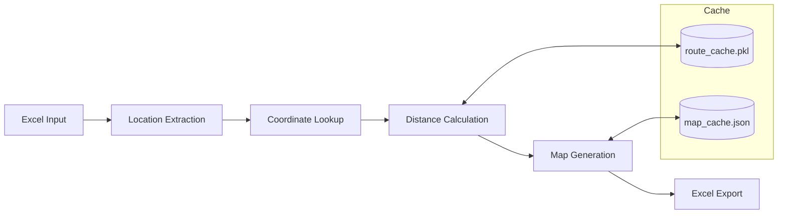

# CLAUDE.md

This file provides guidance to Claude Code (claude.ai/code) when working with code in this repository.

## Project Overview

出差距離計算與地圖產生工具 - A Python desktop application for business travel expense analysis. Calculates distances from 輔仁大學 (Fu Jen University) to domestic/international destinations and generates route maps.

## Tech Stack

- **Language:** Python 3.8+
- **GUI:** Tkinter
- **Data Processing:** pandas, openpyxl, xlsxwriter
- **Mapping:** Folium (OpenStreetMap), Selenium (screenshots)
- **Distance Calculation:** OSRM API (driving), Geopy (geodesic/flying)

## Key Commands

```bash
# Install dependencies
chmod +x install_requirements.sh && ./install_requirements.sh

# Or manually:
pip3 install pandas openpyxl xlsxwriter folium geopy requests pillow selenium

# Run main GUI (recommended - optimized version)
python3 travel_distance_calculator_gui_cached_efficient.py

# Run standard cached GUI
python3 travel_distance_calculator_gui_cached.py

# CLI with distance calculation (process rows 1-100)
python3 process_travel_data_AI.py --with-distance 1 100

# Map zoom demonstration
python3 map_zoom_demo.py

# Run diagnostic tool
python3 diagnose.py

# Test geographic mapping
python3 test_geo_mapping.py
```

## Architecture



**Text version:** `Input Excel → Location Extraction → Coordinate Lookup → Distance Calculation → Map Generation → Excel Export`

### Main Entry Points

| File | Purpose |
|------|---------|
| `travel_distance_calculator_gui_cached_efficient.py` | **Primary GUI** (2344 lines) - Optimized with caching |
| `travel_distance_calculator_gui_cached.py` | Standard GUI with caching |
| `process_travel_data_AI.py` | CLI for location extraction + distance |

### Core Modules

| File | Purpose |
|------|---------|
| `calculate_distances.py` | Distance calculation engine (OSRM + Geopy) |
| `map_utils.py` | Folium map generation with smart zoom |
| `process_travel_data_AI.py` | AI-based location text extraction |

## Data Flow

1. **Input:** Excel files with travel records (目的地 column)
2. **Location Extraction:** Regex + pattern matching → cleaned location names
3. **Coordinate Lookup:** `COORDINATES` dict (hardcoded in main scripts)
4. **Distance Calculation:**
   - Domestic: OSRM API for actual driving distance
   - International: Geodesic distance from 桃園機場 to destination airport
5. **Map Generation:** Folium HTML maps → Selenium PNG screenshots
6. **Output:** `出差距離計算結果_[timestamp].xlsx` with embedded maps

## Critical Data Structures

### COORDINATES Dictionary
Located in main GUI files. Contains:
- All 22 Taiwan counties/cities + district-level locations
- International airport coordinates (20+ countries)
- Special locations (universities, hospitals, train stations)

### Region Mappings
- `DISTRICT_TO_CITY`: Taiwan district → city resolution
- `CHINA_CITY_AIRPORTS`: China city → airport mapping
- Character variants: 台北/臺北, 台中/臺中 unification

## Caching System

- **Location:** `~/.cache/` or `~/Downloads/差旅費/.cache/`
- **Files:**
  - `route_cache.pkl` - Pickled route calculation results
  - `map_cache.json` - Generated map file paths
- Clear via GUI button or delete cache directory

## Output Files

- `出差地點整理結果_AI版.xlsx` - Extracted locations
- `出差距離計算結果_[timestamp].xlsx` - Final results with maps
- `maps/` directory - HTML and PNG map files

## Adding New Locations

Edit the `COORDINATES` dictionary in `travel_distance_calculator_gui_cached_efficient.py`:

```python
COORDINATES = {
    # Taiwan cities
    "台北市": (25.0330, 121.5654),
    # Add new location:
    "新地點": (latitude, longitude),
}
```

## API Dependencies

- **OSRM:** Open Source Routing Machine for driving routes (no API key needed)
- **Fallback:** Geopy geodesic when OSRM unavailable
- Rate limiting handled via caching

## Known Patterns

- **Location variants:** Code handles 台/臺 character variations
- **Missing data:** Labels as "無出差地點"
- **Character corruption:** Regex filters for garbled text
- **Batch processing:** GUI supports row range selection (start/end)

## Code Style

- UTF-8 encoding with shebang: `#!/usr/bin/env python3`
- Chinese comments and variable names acceptable
- Suppress warnings: `warnings.filterwarnings('ignore')`
- Single-file dominant architecture (main logic in GUI file)

## Testing

```bash
# Test geographic mapping functions
python3 test_geo_mapping.py

# Test GUI framework
python3 test_tkinter.py

# Generate test data
python3 create_test_excel.py
python3 create_international_test.py
```

No formal test framework (pytest/unittest) - manual testing via helper scripts.

## Common Modifications

### Adding a new Taiwan district
```python
# In DISTRICT_TO_CITY dict
"天母": "台北",
"淡水": "新北",
```

### Adding a China city with existing airport
```python
# In CHINA_CITY_AIRPORTS dict
"昆山": "上海",  # Uses Shanghai airport
```

### Changing the origin point
Search for `輔仁大學` in COORDINATES and update the coordinates.

## Documentation

| File | Audience | Purpose |
|------|----------|---------|
| `docs/使用手冊.md` | End users | Step-by-step operation guide |
| `docs/技術指南.md` | IT staff | Installation, maintenance, troubleshooting |
| `docs/後續開發建議.md` | Developers | Future improvements and tech roadmap |
| `docs/專案文件架構指南.md` | Architects | PRD, ADR, scaling documentation patterns |
| `ADRs/` | Architects | Architecture Decision Records |
| `README.md` | All | Project overview and quick start |
| `CLAUDE.md` | Claude Code | Development context (this file)

## Technical References

Key external resources for future development:

### Core Libraries
- **Folium**: [python-visualization.github.io/folium](https://python-visualization.github.io/folium/) - Map generation
- **GeoPy**: [geopy.readthedocs.io](https://geopy.readthedocs.io/) - Geocoding and distance
- **OSRM API**: [project-osrm.org/docs](https://project-osrm.org/docs/v5.24.0/api/) - Routing engine

### Upgrade Paths (see `docs/後續開發建議.md`)
- **GUI modernization**: CustomTkinter → PySide6
- **Routing alternatives**: OpenRouteService, GraphHopper
- **Performance**: Folium WebGL plugins for large datasets

### Known Deprecations (2025-2026)
- ⚠️ PySimpleGUI is discontinued - do not use for new features
- ⚠️ Folium `L_PREFER_CANVAS` global switch removed in Leaflet 1.0+
