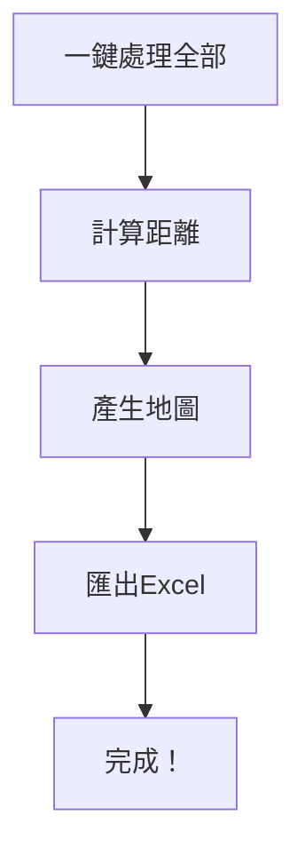
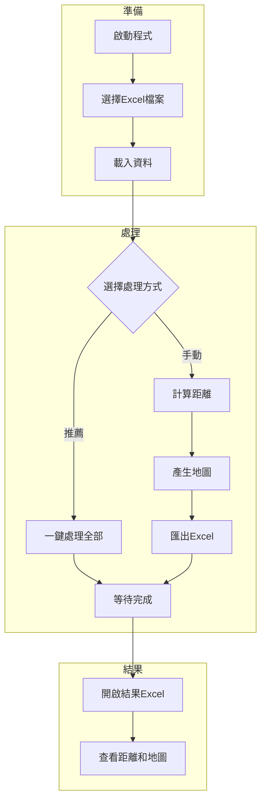

# 出差距離計算工具 - 使用手冊

> 本手冊適用於**一般使用者**，提供操作步驟與常見問題解答。
>
> 技術安裝與維護請參閱：[技術指南](./技術指南.md)

---

## 這個工具能做什麼？

自動分析出差報告，計算從**輔仁大學**到各出差地點的距離，並產生路線地圖。


### 支援的出差類型

| 類型 | 起點 | 計算方式 | 範例 |
|------|------|----------|------|
| **國內出差** | 輔仁大學 | 實際開車距離 | 台北、高雄、花蓮 |
| **國際出差** | 桃園機場 | 飛行直線距離 | 日本、美國、德國 |

---

## 快速開始

### 步驟一：啟動程式

雙擊執行，或在終端機輸入：

```bash
python3 travel_distance_calculator_gui_cached_efficient.py
```

程式視窗會顯示如下介面。

### 步驟二：載入資料

1. 點擊 **「瀏覽」** 按鈕
2. 選擇包含出差記錄的 Excel 檔案
3. 點擊 **「載入資料」**
4. 確認畫面顯示正確的資料筆數

### 步驟三：一鍵處理（推薦）

點擊 **「一鍵處理全部」** 按鈕，程式會自動完成：



### 步驟四：取得結果

處理完成後，結果檔案會儲存在同一目錄：

- `出差距離計算結果_[日期時間].xlsx` - 包含距離和地圖的完整報告

---

## 進階操作

### 只處理部分資料

如果只想處理特定範圍的資料：

1. 載入資料後，修改 **「起始列」** 和 **「結束列」**
2. 例如：起始列 `1`、結束列 `100` = 只處理前 100 筆
3. 點擊各步驟按鈕依序處理

### 手動逐步處理

如果需要更精細的控制：

| 順序 | 按鈕 | 功能 |
|------|------|------|
| 1 | 計算距離 | 識別地點並計算距離 |
| 2 | 產生地圖 | 為每條路線生成地圖 |
| 3 | 匯出Excel | 將結果整合到報告 |

### 清除快取

如果需要重新計算（例如更新了地點座標）：

1. 點擊 **「清除快取」** 按鈕
2. 重新執行處理流程

---

## 結果說明

### Excel 報告內容

| 工作表 | 內容 |
|--------|------|
| 距離計算結果 | 每筆出差的地點、距離、時間 |
| 地圖 | 路線圖截圖（每條唯一路線一張） |

### 結果分類

| 標記 | 意義 |
|------|------|
| ✓ 快取 | 使用已計算過的結果（更快） |
| 無出差地點 | 原始資料未填寫目的地 |
| 未知地點 | 無法識別的地名 |

---

## 常見問題

### Q: 某些地點顯示「未知」怎麼辦？

地點可能不在內建資料庫中。請將地點名稱告知 IT 同事，協助新增座標。

### Q: 處理很慢怎麼辦？

- 首次處理需要呼叫網路 API，較慢是正常的
- 再次處理相同路線會使用快取，速度會大幅提升
- 建議分批處理（每次 100-200 筆）

### Q: 地圖沒有截圖只有 HTML 檔案？

需要安裝 Chrome 瀏覽器才能產生截圖。沒有 Chrome 時，可以手動開啟 `maps/` 目錄下的 HTML 檔案查看地圖。

### Q: 可以更改起點嗎？

預設起點是輔仁大學。如需更改，請聯繫 IT 同事修改程式設定。

### Q: 處理中斷了，資料會遺失嗎？

不會。已計算的結果會存在快取中，重新執行時會自動使用。

---

## 操作流程圖



---

## 聯絡支援

遇到問題時，請提供以下資訊給 IT 同事：

1. 錯誤訊息截圖
2. 處理的 Excel 檔案名稱
3. 無法識別的地點名稱

---

*最後更新：2026-01-24*
