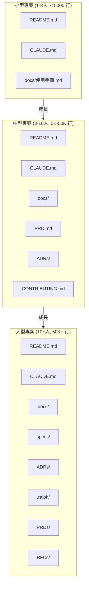
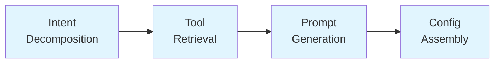
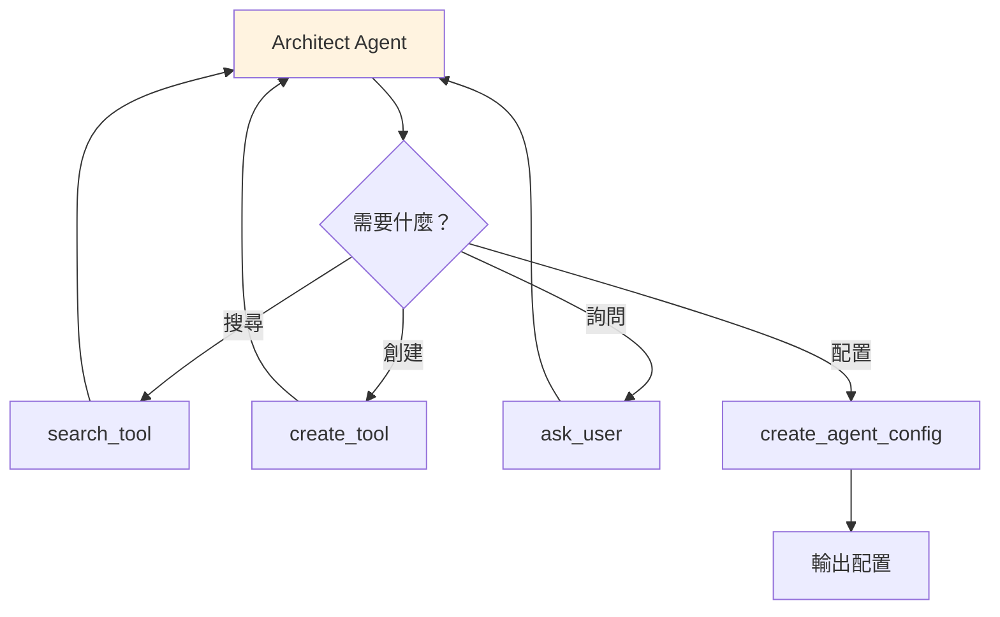

# 專案文件架構指南

> 本指南說明從小型到大型專案的文件分配機制，幫助你在專案成長時採用適當的文件架構。
>
> 參考：[Ralph Claude Code](https://github.com/frankbria/ralph-claude-code)、業界 PRD 最佳實務、Architecture Decision Records (ADR)

---

## 目錄

1. [專案規模與文件需求](#專案規模與文件需求)
2. [當前專案架構（小型）](#當前專案架構小型)
3. [中型專案架構](#中型專案架構)
4. [大型專案架構](#大型專案架構)
5. [PRD 格式範本](#prd-格式範本)
6. [Architecture Decision Records](#architecture-decision-records)
7. [Ralph 模式參考](#ralph-模式參考)
8. [Workflow vs Meta-Agent 模式](#workflow-vs-meta-agent-模式)

---

## 專案規模與文件需求



| 規模 | 團隊 | 程式碼量 | 核心文件 | 選用文件 |
|------|------|----------|----------|----------|
| **小型** | 1-3 人 | < 5K 行 | README, CLAUDE.md, 使用手冊 | 技術指南 |
| **中型** | 3-10 人 | 5K-50K 行 | + PRD, ADRs, CONTRIBUTING | API 文件, 測試計畫 |
| **大型** | 10+ 人 | 50K+ 行 | + specs/, RFCs, .ralph/ | 架構圖, 部署文件, SLA |

---

## 當前專案架構（小型）

你的出差距離計算工具目前採用適合小型專案的結構：

```
家誠差旅費程式/
├── README.md                    # 專案入口
├── CLAUDE.md                    # AI 開發上下文
└── docs/
    ├── 使用手冊.md              # 一般使用者
    ├── 技術指南.md              # IT 維護
    └── 後續開發建議.md          # 技術路線圖
```

**優點：** 簡潔、易維護、足夠滿足需求

**何時升級？** 當出現以下情況時：
- 超過 3 位開發者協作
- 需要追蹤多個功能需求
- 架構決策需要被記錄和審查
- 專案需要正式的變更管理流程

---

## 中型專案架構

當專案成長到 3-10 人團隊時，建議採用以下結構：

```
project/
├── README.md                    # 專案入口（保持簡潔）
├── CLAUDE.md                    # AI 開發上下文
├── CONTRIBUTING.md              # 貢獻指南
├── CHANGELOG.md                 # 變更紀錄
│
├── docs/
│   ├── getting-started.md       # 快速開始
│   ├── user-guide.md            # 使用者手冊
│   ├── admin-guide.md           # 管理者手冊
│   ├── api-reference.md         # API 參考
│   └── architecture.md          # 架構概覽
│
├── specs/                       # 功能規格
│   ├── PRD.md                   # 產品需求文件
│   └── features/
│       ├── feature-001-caching.md
│       └── feature-002-maps.md
│
├── ADRs/                        # 架構決策記錄
│   ├── 0001-use-osrm-for-routing.md
│   ├── 0002-cache-serialization.md
│   └── template.md
│
└── .github/
    ├── ISSUE_TEMPLATE/
    └── PULL_REQUEST_TEMPLATE.md
```

### 新增文件說明

| 文件 | 用途 | 更新頻率 |
|------|------|----------|
| `CONTRIBUTING.md` | 說明如何貢獻程式碼、提交流程 | 低 |
| `CHANGELOG.md` | 版本發布紀錄 | 每次發布 |
| `specs/PRD.md` | 產品需求文件 | 專案開始/重大變更 |
| `ADRs/` | 架構決策記錄 | 每次重大技術決策 |

---

## 大型專案架構

超過 10 人團隊、50K+ 行程式碼時，建議採用 Ralph 風格的結構：

```
project/
├── README.md
├── CLAUDE.md
├── CONTRIBUTING.md
├── CHANGELOG.md
├── CODE_OF_CONDUCT.md           # 行為準則
│
├── .ralph/                      # Ralph 風格狀態追蹤
│   ├── PROMPT.md                # 當前開發指令
│   ├── @fix_plan.md             # 優先任務清單
│   ├── status.json              # 專案狀態
│   ├── specs/                   # 技術規格
│   └── logs/                    # 執行紀錄
│
├── docs/
│   ├── index.md                 # 文件首頁
│   ├── guides/                  # 指南類
│   │   ├── quickstart.md
│   │   ├── user-guide.md
│   │   └── developer-guide.md
│   ├── reference/               # 參考類
│   │   ├── api.md
│   │   ├── config.md
│   │   └── cli.md
│   ├── concepts/                # 概念說明
│   │   ├── architecture.md
│   │   └── data-flow.md
│   └── tutorials/               # 教程類
│       ├── first-feature.md
│       └── advanced-usage.md
│
├── specs/                       # 產品規格
│   ├── PRDs/                    # 產品需求
│   │   ├── PRD-001-v1.0.md
│   │   └── PRD-002-v2.0.md
│   └── RFCs/                    # 技術提案
│       ├── RFC-001-new-cache.md
│       └── template.md
│
├── ADRs/                        # 架構決策
│   ├── 0001-record.md
│   ├── 0002-record.md
│   └── template.md
│
├── tests/
│   └── TEST_PLAN.md             # 測試計畫
│
└── deploy/
    ├── RUNBOOK.md               # 運維手冊
    └── SLA.md                   # 服務等級協議
```

### Diataxis 文件框架

大型專案建議採用 [Diataxis](https://diataxis.fr/) 四象限分類：

```mermaid
quadrantChart
    title 文件類型矩陣
    x-axis 實作導向 --> 理解導向
    y-axis 學習時使用 --> 工作時使用
    quadrant-1 概念說明 (Explanation)
    quadrant-2 教程 (Tutorial)
    quadrant-3 指南 (How-to)
    quadrant-4 參考 (Reference)
```

| 象限 | 類型 | 目的 | 範例 |
|------|------|------|------|
| **Tutorial** | 教程 | 帶領新手完成任務 | `first-feature.md` |
| **How-to** | 指南 | 解決特定問題 | `user-guide.md` |
| **Reference** | 參考 | 完整技術規格 | `api.md` |
| **Explanation** | 概念 | 背景知識說明 | `architecture.md` |

---

## PRD 格式範本

根據 [Product School](https://productschool.com/blog/product-strategy/product-template-requirements-document-prd) 和 [Atlassian](https://www.atlassian.com/agile/product-management/requirements) 的最佳實務：

```markdown
# PRD: [功能名稱]

## 元資料
| 項目 | 內容 |
|------|------|
| 版本 | v1.0 |
| 作者 | [姓名] |
| 狀態 | Draft / In Review / Approved |
| 建立日期 | YYYY-MM-DD |
| 最後更新 | YYYY-MM-DD |

## 1. 概述

### 1.1 問題陳述
[描述要解決的問題，用資料或研究支持]

### 1.2 目標
- **業務目標**: [與公司策略的關聯]
- **用戶目標**: [用戶希望達成的結果]

### 1.3 成功指標 (SMART)
| 指標 | 目標值 | 衡量方式 |
|------|--------|----------|
| [指標1] | [數值] | [如何測量] |

## 2. 用戶與場景

### 2.1 目標用戶
[描述 Persona：誰、什麼背景、什麼需求]

### 2.2 使用場景
**場景 1**: [描述典型使用流程]

## 3. 功能需求

### 3.1 Must-Have (P0)
- [ ] [功能描述]
  - **驗收標準**: Given [前置條件], When [動作], Then [結果]

### 3.2 Should-Have (P1)
- [ ] [功能描述]

### 3.3 Nice-to-Have (P2)
- [ ] [功能描述]

## 4. 非功能需求

| 類別 | 需求 |
|------|------|
| 效能 | [回應時間、吞吐量] |
| 安全 | [認證、授權] |
| 可用性 | [SLA 目標] |

## 5. 設計限制

- [技術限制]
- [時間限制]
- [資源限制]

## 6. 時程

| 里程碑 | 日期 | 交付物 |
|--------|------|--------|
| 設計完成 | YYYY-MM-DD | 設計稿 |
| 開發完成 | YYYY-MM-DD | 功能程式碼 |
| 測試完成 | YYYY-MM-DD | 測試報告 |

## 7. 風險與緩解

| 風險 | 影響 | 機率 | 緩解策略 |
|------|------|------|----------|
| [風險] | 高/中/低 | 高/中/低 | [策略] |

## 8. 附錄

- [相關文件連結]
- [設計稿連結]
- [參考資料]
```

### PRD 最佳實務

1. **從問題開始**，不是從解決方案
2. **定義可測量的成功指標**（SMART 原則）
3. **使用 Given/When/Then** 格式撰寫驗收標準
4. **分離功能與非功能需求**
5. **視為活文件**，持續更新
6. **早期協作**：設計 → 工程 → QA

---

## Architecture Decision Records

根據 [Michael Nygard 原始提案](https://cognitect.com/blog/2011/11/15/documenting-architecture-decisions) 和 [Azure Well-Architected Framework](https://learn.microsoft.com/en-us/azure/well-architected/architect-role/architecture-decision-record)：

### ADR 範本

```markdown
# ADR-0001: [決策標題]

## 狀態
Proposed | Accepted | Deprecated | Superseded by [ADR-XXXX]

## 背景
[描述問題的背景和驅動力]

## 決策
[明確說明做了什麼決定]

## 理由
[為什麼這樣決定？考慮了哪些替代方案？]

## 後果
### 正面
- [好處]

### 負面
- [代價/風險]

### 中性
- [其他影響]

## 相關
- [相關 ADR]
- [相關文件]
```

### ADR 範例（本專案）

```markdown
# ADR-0001: 使用 OSRM 作為路由引擎

## 狀態
Accepted

## 背景
專案需要計算國內出差的實際開車距離，需要一個路由 API。

## 決策
使用 OSRM (Open Source Routing Machine) 公共 API。

## 理由
考慮的替代方案：
1. Google Maps API - 需要付費，有使用量限制
2. GraphHopper - 需要自架或付費
3. Valhalla - 設定複雜

選擇 OSRM 因為：
- 免費公共 API
- 無需 API Key
- 使用 OpenStreetMap 資料，台灣覆蓋良好

## 後果
### 正面
- 零成本
- 實際道路距離（非直線距離）

### 負面
- 無即時路況
- 公共服務可能被限速
- 無 SLA 保證

### 中性
- 需要實作快取機制減少 API 呼叫
```

---

## Ralph 模式參考

[Ralph Claude Code](https://github.com/frankbria/ralph-claude-code) 專案提供了自主開發循環的文件架構：

### .ralph/ 目錄結構

```
.ralph/
├── PROMPT.md          # 當前開發指令（Claude 閱讀）
├── @fix_plan.md       # 優先任務清單（checkbox 格式）
├── status.json        # 專案狀態追蹤
├── specs/             # 技術規格
│   └── requirements.md
└── logs/              # 執行紀錄
    └── session-001.log
```

### PROMPT.md 格式

```markdown
# 開發指令

## 當前任務
[描述當前要完成的任務]

## 上下文
[相關背景資訊]

## 限制
- [技術限制]
- [時間限制]

## 驗收標準
- [ ] [標準1]
- [ ] [標準2]
```

### @fix_plan.md 格式

```markdown
# 任務計畫

## P0 - 必須完成
- [ ] 修復快取過期問題
- [ ] 新增錯誤處理

## P1 - 應該完成
- [ ] 優化地圖載入速度
- [ ] 新增進度條

## P2 - 可以完成
- [ ] 改善 UI 外觀
```

### RALPH_STATUS 區塊

Ralph 使用特殊格式追蹤 Agent 完成狀態：

```markdown
<!-- RALPH_STATUS
completion_indicators: 3
EXIT_SIGNAL: true
last_task: "完成快取優化"
next_action: null
-->
```

**雙條件退出機制**：`completion_indicators >= 2 AND EXIT_SIGNAL: true`

---

## Workflow vs Meta-Agent 模式

你提到的兩種模式適用於不同場景：

### Workflow Mode（確定性管線）



**特點：**
- 四階段固定流程
- 可預測、可重現
- 適合標準化任務

**適用場景：**
- CI/CD 管線
- 批次處理
- 規範化的開發流程

**文件需求：**
```
pipeline/
├── stages/
│   ├── 01-decomposition.md
│   ├── 02-retrieval.md
│   ├── 03-generation.md
│   └── 04-assembly.md
├── config.yaml
└── README.md
```

### Meta-Agent Mode（彈性架構師）



**特點：**
- 動態決策
- 自主選擇工具
- 適合複雜、非結構化任務

**適用場景：**
- 探索性開發
- 問題診斷
- 需求不明確的任務

**文件需求：**
```
agents/
├── architect/
│   ├── system-prompt.md
│   ├── tools.yaml
│   └── examples/
├── specialist/
│   └── ...
└── README.md
```

### 選擇建議

| 考量 | Workflow Mode | Meta-Agent Mode |
|------|---------------|-----------------|
| **任務類型** | 標準化、重複性 | 探索性、創意性 |
| **可預測性** | 高 | 低 |
| **調試難度** | 低 | 中-高 |
| **靈活性** | 低 | 高 |
| **文件複雜度** | 中 | 高 |

**建議：** 從 Workflow Mode 開始，當需要更多靈活性時再引入 Meta-Agent。

---

## 本專案升級路徑

### 階段一：維持現狀（小型專案）
```
現有文件：
- README.md
- CLAUDE.md
- docs/使用手冊.md
- docs/技術指南.md
- docs/後續開發建議.md
```

### 階段二：中型專案準備
```diff
+ CONTRIBUTING.md
+ CHANGELOG.md
+ ADRs/0001-use-osrm.md
+ specs/PRD.md
```

### 階段三：大型專案演進
```diff
+ .ralph/PROMPT.md
+ .ralph/@fix_plan.md
+ specs/RFCs/
+ docs/reference/
+ docs/tutorials/
```

---

## 總結

| 專案規模 | 核心文件 | 關鍵新增 |
|----------|----------|----------|
| **小型** | README, CLAUDE.md, 使用手冊 | - |
| **中型** | + PRD, ADRs, CONTRIBUTING | 需求追蹤、決策記錄 |
| **大型** | + .ralph/, RFCs, Diataxis | 自主開發循環、技術提案 |

**下一步建議：**
1. 如果專案維持 1-3 人，現有架構已足夠
2. 當加入第 4 位開發者時，新增 `CONTRIBUTING.md` 和第一份 ADR
3. 當功能需求增加時，撰寫 `PRD.md`

---

## 參考資源

### PRD 與需求管理
- [Product School - PRD Template](https://productschool.com/blog/product-strategy/product-template-requirements-document-prd)
- [Atlassian - Product Requirements](https://www.atlassian.com/agile/product-management/requirements)
- [Aha! - PRD Templates](https://www.aha.io/roadmapping/guide/requirements-management/what-is-a-good-product-requirements-document-template)

### Architecture Decision Records
- [ADR GitHub Organization](https://adr.github.io/)
- [Michael Nygard - Documenting Architecture Decisions](https://cognitect.com/blog/2011/11/15/documenting-architecture-decisions)
- [Azure Well-Architected Framework - ADR](https://learn.microsoft.com/en-us/azure/well-architected/architect-role/architecture-decision-record)
- [joelparkerhenderson/architecture-decision-record](https://github.com/joelparkerhenderson/architecture-decision-record)

### Ralph 模式
- [Ralph Claude Code](https://github.com/frankbria/ralph-claude-code)

### 文件框架
- [Diataxis](https://diataxis.fr/) - 文件四象限分類
- [The Good Docs Project](https://thegooddocsproject.dev/) - 開源文件模板

---

*本指南隨專案成長而演進，建議每季審視一次文件需求*
