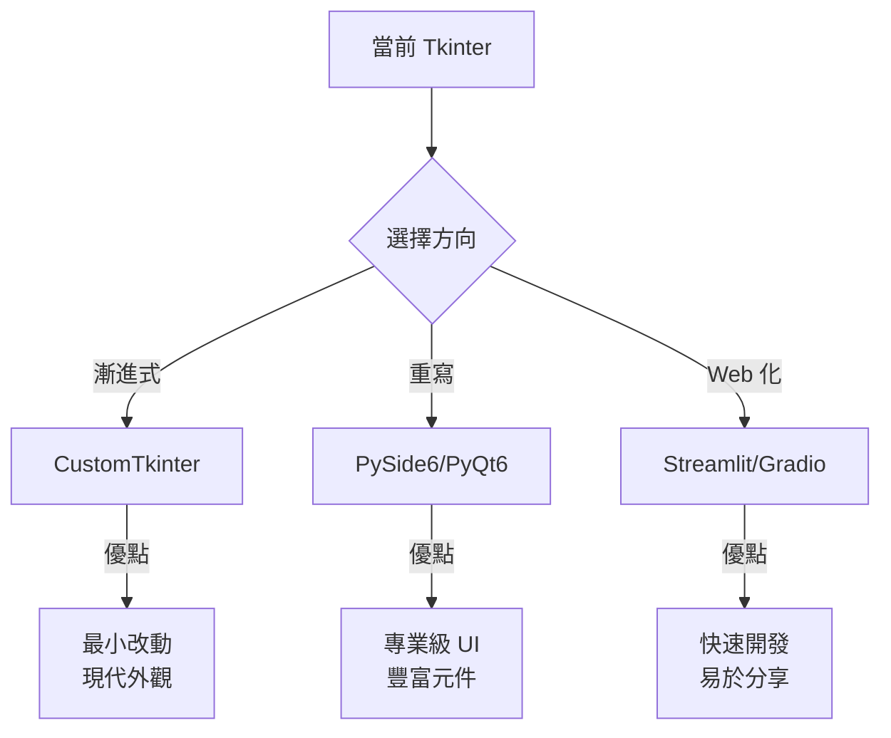
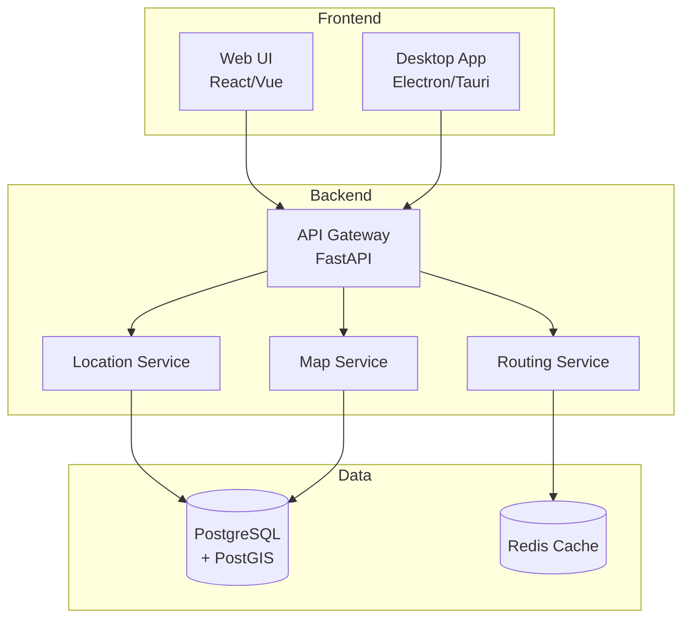
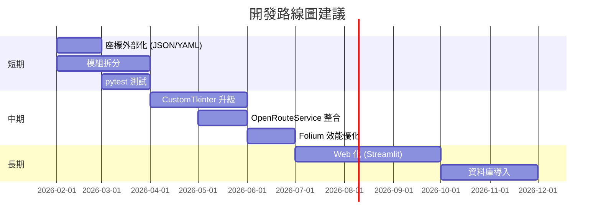

# 後續開發建議

> 本文件為技術架構師提供的長期演進方向，包含技術債評估、現代化建議、以及參考資源。
>
> 最後更新：2026-01-24

---

## 目錄

1. [當前架構評估](#當前架構評估)
2. [短期優化（0-3 個月）](#短期優化0-3-個月)
3. [中期演進（3-12 個月）](#中期演進3-12-個月)
4. [長期重構（12+ 個月）](#長期重構12-個月)
5. [技術選型參考](#技術選型參考)
6. [學習資源](#學習資源)

---

## 當前架構評估

### 優點

| 項目 | 說明 |
|------|------|
| ✅ 快取機制 | Pickle + JSON 快取有效減少 API 呼叫 |
| ✅ 無外部依賴服務 | OSRM 是免費公共 API，無需 API Key |
| ✅ 離線備援 | Geopy geodesic 計算不需網路 |
| ✅ 批次處理 | 支援分段處理大量資料 |

### 技術債

| 項目 | 風險等級 | 說明 |
|------|----------|------|
| 🔴 單一巨型檔案 | 高 | 主 GUI 檔案 2344 行，難以維護和測試 |
| 🟡 硬編碼座標 | 中 | COORDINATES 字典嵌入程式碼，新增需改程式 |
| 🟡 無自動化測試 | 中 | 僅有手動測試腳本，無 CI/CD |
| 🟠 Tkinter 限制 | 低-中 | 介面較傳統，跨平台一致性有限 |
| 🟢 無即時路況 | 低 | OSRM 不提供即時交通資訊 |

---

## 短期優化（0-3 個月）

### 1. 座標資料外部化

**現況：** 座標硬編碼在 Python 檔案中

**建議：** 抽離成 JSON/YAML 設定檔

```yaml
# coordinates.yaml
taiwan:
  台北市:
    lat: 25.0330
    lon: 121.5654
    type: domestic

international:
  日本:
    lat: 35.5494
    lon: 139.7798
    airport: 成田機場
```

**優點：**
- 非技術人員可透過編輯設定檔新增地點
- 支援版本控制追蹤變更歷史
- 可獨立測試座標資料完整性

### 2. 模組拆分

將 2344 行的主檔案拆分為：

```
src/
├── __init__.py
├── main.py                 # 進入點
├── gui/
│   ├── app.py              # Tkinter 主視窗
│   └── widgets.py          # 自訂元件
├── core/
│   ├── location.py         # 地點識別邏輯
│   ├── distance.py         # 距離計算
│   └── mapping.py          # 地圖生成
├── data/
│   ├── coordinates.yaml    # 座標設定
│   └── mappings.yaml       # 區域對應
└── utils/
    ├── cache.py            # 快取管理
    └── excel.py            # Excel 讀寫
```

### 3. 引入 pytest 測試框架

```bash
pip install pytest pytest-cov
```

```python
# tests/test_location.py
def test_district_to_city():
    assert resolve_location("南港") == "台北"
    assert resolve_location("板橋") == "新北"

def test_china_airport_mapping():
    assert get_airport("蘇州") == "上海"
```

---

## 中期演進（3-12 個月）

### 1. GUI 現代化選項



#### 選項 A：CustomTkinter（推薦起步）

**適用場景：** 想保留現有架構，快速改善外觀

```python
# 安裝
pip install customtkinter

# 改動最小，只需替換 import
import customtkinter as ctk
# 原本：import tkinter as tk
```

**參考：**
- [CustomTkinter GitHub](https://github.com/TomSchimansky/CustomTkinter)
- [CustomTkinter 文件](https://customtkinter.tomschimansky.com/)

#### 選項 B：PySide6（完整重寫）

**適用場景：** 需要專業級 UI、複雜互動

```bash
pip install PySide6
```

**注意：** PySide6 是 Qt 官方綁定，使用 LGPL 授權，商業友善

**參考：**
- [PySide6 官方教學](https://doc.qt.io/qtforpython-6/)
- [Python GUIs - PySide6 教學](https://www.pythonguis.com/pyside6/)

#### 選項 C：Streamlit（Web 化）

**適用場景：** 需要多人共用、遠端存取

```bash
pip install streamlit
streamlit run app.py
```

**參考：**
- [Streamlit 官方](https://streamlit.io/)
- [streamlit-folium](https://github.com/randyzwitch/streamlit-folium) - Folium 整合

### 2. 路由 API 升級

#### 現況：OSRM 公共服務

**限制：**
- 無即時路況
- 公共服務可能被限速
- 無法自訂路由偏好

#### 建議替代方案

| 服務 | 授權 | 即時路況 | 自架 | 推薦度 |
|------|------|----------|------|--------|
| [OpenRouteService](https://openrouteservice.org/) | 免費 API | ❌ | ✅ | ⭐⭐⭐⭐⭐ |
| [GraphHopper](https://www.graphhopper.com/) | 免費層 | ✅ | ✅ | ⭐⭐⭐⭐ |
| [Valhalla](https://github.com/valhalla/valhalla) | 開源 | ❌ | ✅ | ⭐⭐⭐ |
| [Mapbox Directions](https://www.mapbox.com/) | 付費 | ✅ | ❌ | ⭐⭐⭐ |

**OpenRouteService 範例：**

```python
import openrouteservice

client = openrouteservice.Client(key='YOUR_API_KEY')  # 免費申請
route = client.directions(
    coordinates=[[121.4320, 25.0365], [121.5654, 25.0330]],
    profile='driving-car'
)
```

**參考：**
- [OpenRouteService API 文件](https://openrouteservice.org/dev/#/api-docs)
- [NextBillion.ai - 2025 開源路由工具比較](https://nextbillion.ai/blog/top-open-source-tools-for-route-optimization)

### 3. Folium 效能優化

#### 大量標記問題

當標記超過 1000 個時，Folium 渲染會變慢

**解決方案：**

```python
# 1. 使用 CircleMarker 替代 Marker（更快）
folium.CircleMarker(location, radius=5).add_to(map)

# 2. 使用 MarkerCluster
from folium.plugins import MarkerCluster
cluster = MarkerCluster().add_to(map)

# 3. 使用 WebGL 渲染（大資料集）
# pip install folium-glify-layer
```

**參考：**
- [Folium 效能優化討論](https://github.com/python-visualization/folium/issues/1131)
- [Folium 官方文件](https://python-visualization.github.io/folium/)

---

## 長期重構（12+ 個月）

### 1. 微服務架構



### 2. 資料庫導入

**現況：** Excel 輸入/輸出，Pickle 快取

**建議：** PostgreSQL + PostGIS

**優點：**
- 空間索引加速地理查詢
- 多人協作
- 資料完整性保證

```sql
-- 範例：地點表
CREATE TABLE locations (
    id SERIAL PRIMARY KEY,
    name VARCHAR(100),
    coordinates GEOGRAPHY(POINT),
    type VARCHAR(20),
    airport_name VARCHAR(100)
);

CREATE INDEX idx_locations_geo ON locations USING GIST(coordinates);
```

### 3. 容器化部署

```dockerfile
# Dockerfile
FROM python:3.11-slim
WORKDIR /app
COPY requirements.txt .
RUN pip install -r requirements.txt
COPY . .
CMD ["python", "main.py"]
```

```yaml
# docker-compose.yml
services:
  app:
    build: .
    ports:
      - "8501:8501"
  postgres:
    image: postgis/postgis:15-3.3
    environment:
      POSTGRES_PASSWORD: secret
```

---

## 技術選型參考

### GUI 框架比較（2025-2026）

| 框架 | 學習曲線 | 外觀 | 跨平台 | 授權 | 建議 |
|------|----------|------|--------|------|------|
| Tkinter | 低 | 傳統 | ✅ | 內建 | 快速原型 |
| CustomTkinter | 低 | 現代 | ✅ | MIT | ⭐ 漸進升級 |
| PySide6 | 中 | 專業 | ✅ | LGPL | ⭐ 完整重寫 |
| PyQt6 | 中 | 專業 | ✅ | GPL/商業 | 需注意授權 |
| Kivy | 中-高 | 自訂 | ✅ | MIT | 觸控應用 |
| Dear PyGui | 中 | GPU 加速 | ✅ | MIT | 儀表板 |

**⚠️ 注意：** [PySimpleGUI 已於 2024 年停止開發](https://www.pythonguis.com/faq/which-python-gui-library/)，不建議用於新專案

### Geocoding 函式庫比較

| 函式庫 | 提供者數 | 離線 | 非同步 | 建議 |
|--------|----------|------|--------|------|
| [GeoPy](https://github.com/geopy/geopy) | 17+ | ❌ | ✅ | ⭐ 維持現狀 |
| [Geocoder](https://github.com/DenisCarriere/geocoder) | 18+ | ❌ | ❌ | 替代選項 |
| [libpostal](https://github.com/openvenues/libpostal) | - | ✅ | ❌ | 地址解析 |

---

## 學習資源

### Python GUI 開發

| 資源 | 說明 | 連結 |
|------|------|------|
| Python GUIs | PySide6/PyQt6 完整教學 | [pythonguis.com](https://www.pythonguis.com/) |
| CustomTkinter Wiki | 官方文件 | [GitHub Wiki](https://github.com/TomSchimansky/CustomTkinter/wiki) |
| Tkinter vs PyQt 比較 | 選型參考 | [PythonGUIs 文章](https://www.pythonguis.com/faq/pyqt-vs-tkinter/) |

### 地圖與地理資訊

| 資源 | 說明 | 連結 |
|------|------|------|
| Folium 文件 | 官方 API 參考 | [python-visualization.github.io](https://python-visualization.github.io/folium/) |
| OpenRouteService | 免費路由 API | [openrouteservice.org](https://openrouteservice.org/) |
| GeoPy 文件 | Geocoding 函式庫 | [geopy.readthedocs.io](https://geopy.readthedocs.io/) |
| OSRM API 文件 | 路由 API 規格 | [project-osrm.org](https://project-osrm.org/docs/v5.24.0/api/) |

### 架構與最佳實務

| 資源 | 說明 | 連結 |
|------|------|------|
| 開源路由工具比較 | 2025 年評測 | [NextBillion.ai](https://nextbillion.ai/blog/top-open-source-tools-for-route-optimization) |
| Python 專案結構 | 模組化建議 | [Real Python](https://realpython.com/python-application-layouts/) |
| Folium 效能優化 | 大量標記處理 | [GitHub Issue #1131](https://github.com/python-visualization/folium/issues/1131) |

---

## 優先級建議



---

## 總結

| 階段 | 重點 | 預期效益 |
|------|------|----------|
| **短期** | 座標外部化、模組拆分、測試 | 可維護性提升、非技術人員可新增地點 |
| **中期** | GUI 現代化、API 升級 | 使用體驗改善、減少 API 限制 |
| **長期** | Web 化、資料庫 | 多人協作、企業級擴展 |

**建議起步：** 從「座標外部化」和「CustomTkinter」開始，投入產出比最高。

---

*本文件由 Claude Code 協助撰寫，技術選型請依實際需求評估*

## Sources

- [Python GUIs - Which Python GUI library?](https://www.pythonguis.com/faq/which-python-gui-library/)
- [NextBillion.ai - Top Open-Source Tools for Route Optimization](https://nextbillion.ai/blog/top-open-source-tools-for-route-optimization)
- [OpenRouteService](https://openrouteservice.org/)
- [Folium Performance Issues - GitHub](https://github.com/python-visualization/folium/issues/1131)
- [GeoPy GitHub](https://github.com/geopy/geopy)
- [OSRM API Documentation](https://project-osrm.org/docs/v5.24.0/api/)
- [CustomTkinter GitHub](https://github.com/TomSchimansky/CustomTkinter)
- [PySide6 Documentation](https://doc.qt.io/qtforpython-6/)
