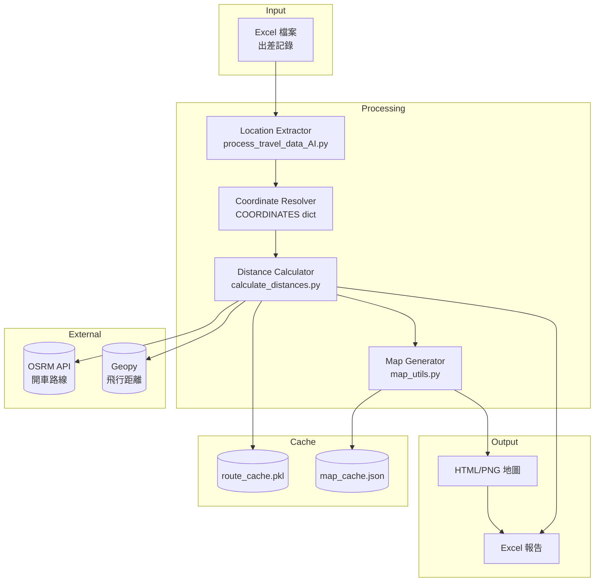
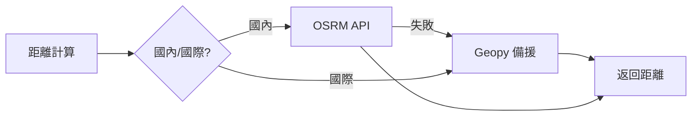

# 出差距離計算工具 - 技術指南

> 本指南適用於 **IT 人員**，涵蓋安裝、維護、擴展與故障排除。
>
> 一般操作請參閱：[使用手冊](./使用手冊.md)

---

## 系統架構



---

## 環境需求

| 項目 | 需求 |
|------|------|
| Python | 3.8+ |
| 作業系統 | macOS / Windows / Linux |
| 網路 | 需要（呼叫 OSRM API） |
| Chrome | 選用（地圖截圖功能） |

---

## 安裝步驟

### 1. 安裝 Python 依賴

```bash
# 使用安裝腳本
chmod +x install_requirements.sh
./install_requirements.sh

# 或手動安裝
pip3 install pandas openpyxl xlsxwriter folium geopy requests pillow selenium
```

### 2. 安裝 Chrome（選用，用於地圖截圖）

**macOS:**
```bash
brew install --cask google-chrome
brew install chromedriver
```

**Windows:**
- 下載安裝 Chrome
- 下載對應版本的 ChromeDriver，放入 PATH

### 3. 驗證安裝

```bash
python3 diagnose.py
```

---

## 檔案結構

```
.
├── travel_distance_calculator_gui_cached_efficient.py  # ★ 主程式 GUI
├── travel_distance_calculator_gui_cached.py            # 舊版 GUI
├── process_travel_data_AI.py                           # 地點提取引擎
├── calculate_distances.py                              # 距離計算模組
├── map_utils.py                                        # 地圖生成模組
├── docs/
│   ├── 使用手冊.md                                     # 一般使用者文件
│   └── 技術指南.md                                     # 本文件
├── maps/                                               # 生成的地圖檔案
└── .cache/                                             # 快取目錄
    ├── route_cache.pkl                                 # 路線快取
    └── map_cache.json                                  # 地圖路徑快取
```

---

## 核心資料結構

### COORDINATES 字典

位於 `travel_distance_calculator_gui_cached_efficient.py`，定義所有已知地點的座標。

```python
COORDINATES = {
    # 台灣縣市
    "台北市": (25.0330, 121.5654),
    "新北市": (25.0120, 121.4650),

    # 國際機場
    "日本": (35.5494, 139.7798),  # 成田機場
    "美國": (33.9425, -118.4081),  # LAX

    # 特殊地點
    "輔仁大學": (25.0365, 121.4320),
    "桃園機場": (25.0797, 121.2342),
}
```

### 區域對應表

```python
DISTRICT_TO_CITY = {
    # 台北區域
    "南港": "台北", "松山": "台北", "信義": "台北",
    # 新北區域
    "板橋": "新北", "三重": "新北", "中和": "新北",
}

CHINA_CITY_AIRPORTS = {
    "蘇州": "上海", "無錫": "上海",  # 使用上海機場
    "佛山": "廣州", "珠海": "廣州",  # 使用廣州機場
}
```

---

## 新增地點

### 新增台灣地點

1. 開啟 `travel_distance_calculator_gui_cached_efficient.py`
2. 找到 `COORDINATES` 字典
3. 新增座標：

```python
"新竹科學園區": (24.7857, 121.0000),
```

4. 若為某城市的區域，加入 `DISTRICT_TO_CITY`：

```python
"竹北": "新竹",
```

### 新增國際地點

```python
# 在 COORDINATES 加入機場座標
"越南": (21.2212, 105.8070),  # 河內機場
```

### 新增中國城市

```python
# 在 CHINA_CITY_AIRPORTS 加入對應
"常州": "上海",  # 使用上海機場
```

### 清除快取使新地點生效

```bash
rm -rf ~/.cache/route_cache.pkl ~/.cache/map_cache.json
```

---

## 快取管理

### 快取位置

```
~/.cache/
├── route_cache.pkl    # 路線計算結果（Pickle 格式）
└── map_cache.json     # 地圖檔案路徑
```

或

```
~/Downloads/差旅費/.cache/
```

### 快取機制流程


### 快取維護指令

```bash
# 查看快取大小
du -sh ~/.cache/

# 清除所有快取
rm -rf ~/.cache/route_cache.pkl ~/.cache/map_cache.json

# 只清除地圖快取
rm ~/.cache/map_cache.json
```

---

## API 依賴

### OSRM（開車路線）

- **端點**: `http://router.project-osrm.org/route/v1/driving/`
- **用途**: 計算國內實際開車距離
- **無需 API Key**
- **限制**: 公共服務，大量請求可能被限速

### Geopy（飛行距離）

- **模式**: 離線計算
- **用途**: 國際航線直線距離
- **公式**: Geodesic（考慮地球曲率）

### 備援機制



---

## 執行模式

### GUI 模式（推薦）

```bash
python3 travel_distance_calculator_gui_cached_efficient.py
```

### CLI 模式

```bash
# 處理指定範圍
python3 process_travel_data_AI.py --with-distance 1 100

# 只提取地點（不計算距離）
python3 process_travel_data_AI.py
```

### 強制顯示 GUI（macOS）

```bash
pythonw travel_distance_calculator_gui_cached_efficient.py
# 或
python3 force_gui.py
```

---

## 故障排除

### 問題：GUI 視窗不顯示

**原因**: macOS 終端機 Python 可能無法顯示 Tkinter

**解決**:
```bash
pythonw travel_distance_calculator_gui_cached_efficient.py
```

### 問題：地圖截圖失敗

**原因**: 缺少 Chrome 或 ChromeDriver

**解決**:
```bash
# macOS
brew install --cask google-chrome
brew install chromedriver

# 驗證
chromedriver --version
```

### 問題：OSRM API 回應緩慢或失敗

**原因**: 網路問題或 API 限速

**解決**:
1. 檢查網路連線
2. 分批處理（每批 50-100 筆）
3. 使用快取避免重複請求

### 問題：某地點顯示「未知」

**原因**: 地點不在 COORDINATES 字典

**解決**:
1. 查詢地點座標（Google Maps）
2. 新增到 COORDINATES
3. 清除快取

### 問題：快取檔案損壞

**症狀**: 程式啟動時報錯

**解決**:
```bash
rm -rf ~/.cache/route_cache.pkl
```

---

## 效能調校

### 建議的批次大小

| 資料量 | 建議批次 | 預估時間（首次） |
|--------|----------|------------------|
| < 100 筆 | 一次處理 | 2-3 分鐘 |
| 100-500 筆 | 100 筆/批 | 10-15 分鐘 |
| > 500 筆 | 100 筆/批 | 按比例增加 |

### 快取命中後效能

| 情境 | 時間 |
|------|------|
| 100% 快取命中 | < 30 秒 |
| 50% 快取命中 | 原時間的一半 |

---

## 開發指引

### 程式碼風格

- Python 3.8+ 語法
- UTF-8 編碼
- 中文註解

### 測試

```bash
# 測試地理對應功能
python3 test_geo_mapping.py

# 測試 GUI 框架
python3 test_tkinter.py

# 產生測試資料
python3 create_test_excel.py
```

### 診斷工具

```bash
python3 diagnose.py
```

輸出環境資訊和依賴狀態。

---

## 變更紀錄

| 版本 | 日期 | 變更內容 |
|------|------|----------|
| 2.0 | 2024 | 新增快取機制、智能縮放 |
| 1.5 | 2024 | 新增中國城市機場對應 |
| 1.0 | 2023 | 初始版本 |

---

*最後更新：2026-01-24*
